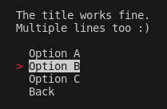

# Terminal Menu
Interactive terminal menu in C++.



## Usage
Change your selection with the "Up" and "Down" arrow keys.
Press "Enter" to confirm,
and "Esc" or "Q" to exit the menu.
In the current state, the following features are available:

1. Add single or multi line title to menu.
2. Set color theme (text and background colors).
3. Add "Back" to the list of options (for nested menus).

### Upcoming Features
1. Search through the menu.
2. Import menu tree from JSON.
3. Optional clear screen (currently hard-coded to clear it).


## Build & Run Example
Steps to build the library (.so) and the included example.
You can also use "make lib" to build the library ONLY.

```bash
make 
export LD_LIBRARY_PATH=$(pwd)/build:$LD_LIBRARY_PATH
./build/example.out
```

## Functions

```C++
int TerminalMenu::showMenu(std::vector<std::string> options, std::string title = "", bool back = false)
```

- **Return:** Index of the option selected *[0, n]* or **-1** if no option is selected.
- **std::vector\<std::string\> options:** List of options in the menu.
- **std::string title:** *OPTIONAL* Menu title that appears above the list of options
- **bool back:** *OPTIONAL* Adds a "Back" button to **options** if set to **true**.

```C++
void TerminalMenu::setTheme(const Theme& fg, const Theme& bg)
```

- **const Theme& fg:** foreground (text) color info.
- **const Theme& bg:** background color info.
- **struct Theme:** 8 basic colors x 2 brightness levels = 16 supported colors.

```C++
// from "colors.hpp":
struct Theme {
    int mode;
    Color color;
};
```
- **Theme::(int)mode:**

    - ANSI_FG_STNDRD
    - ANSI_BG_STNDRD
    - ANSI_FG_BRIGHT
    - ANSI_BG_BRIGHT

- **Theme::(Color)color:**

    - BLACK
    - RED
    - GREEN
    - YELLOW
    - BLUE
    - MAGENTA
    - CYAN
    - WHITE
